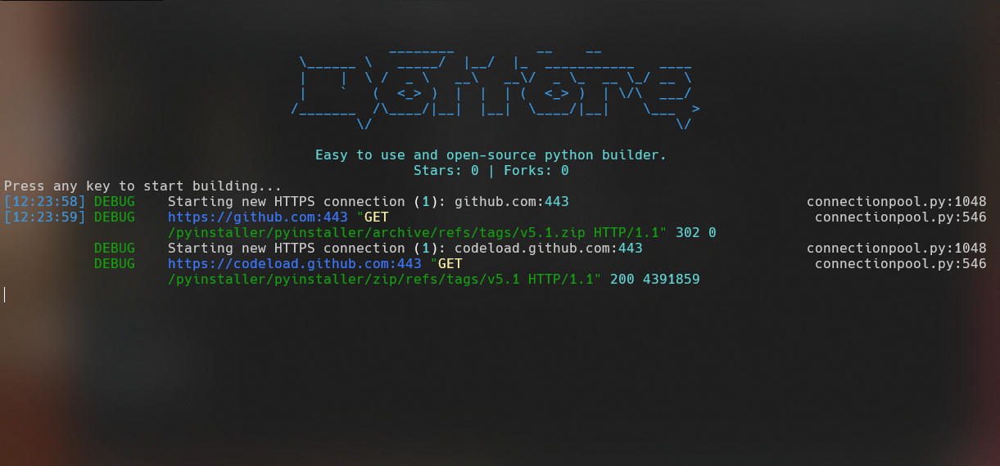

# Dottore
> Dottore is an free and open-source Python builder which obfuscates and builds an python file to an .exe application

## Preview

## Build
Change the code in [src/main.py](./src/main.py) to your applications code after that just start **Dottore** with the [start.bat](./start.bat) Batch file.

You can find your obfuscated .exe in the dist folder which will be created as soon as you start Dottore.